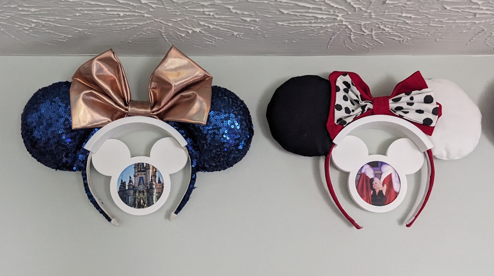
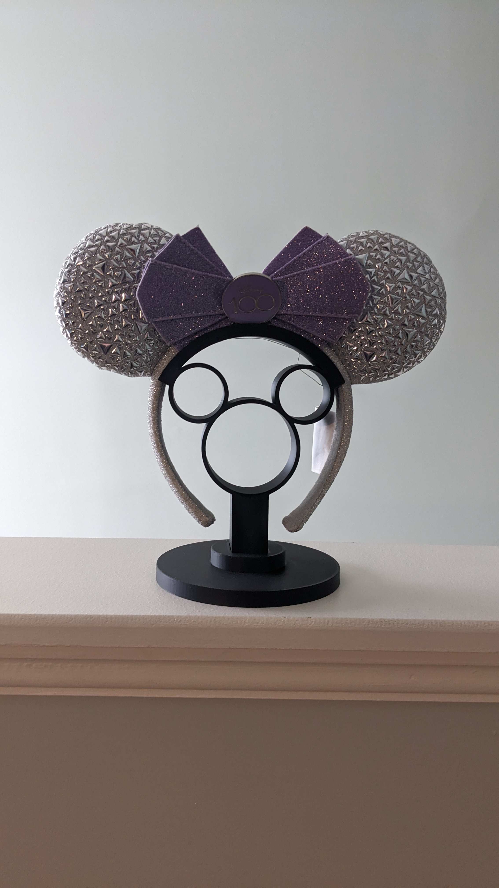

# Minnie Ear Frame

OpenSCAD project to create a wall mountable display for Minnie Mouse ear hand bands via OpenSCAD.  Also generates a freestanding version.

## Versioning Policy

- **Major** : a significate rewrite of the code or a redesign of the model
- **Minor** : one or more components are added or removed from the model
- **Patch** : a parameterized value is modified